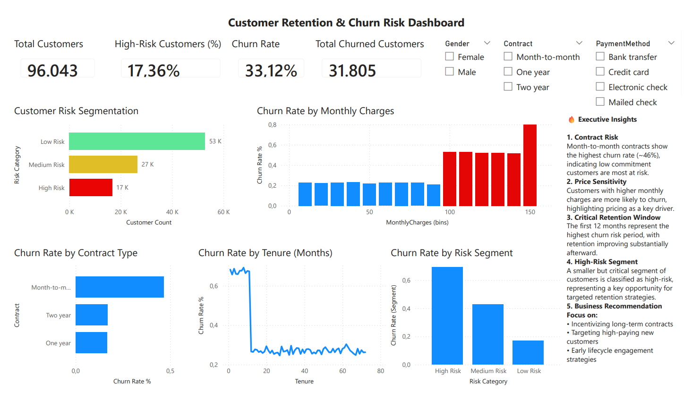
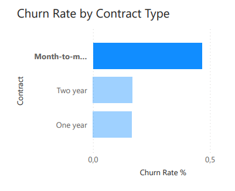
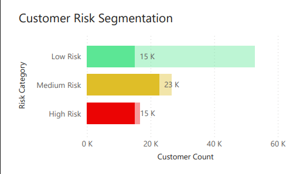

🔗 **Live Demo (Power BI):**  
[View Dashboard](https://bit.ly/3Qadvjk)

🔗 **GitHub Repository:**  
https://github.com/RuiCDev

🚀 🚀 SaaS Customer Retention & Churn Prediction (End-to-End Analytics Project)
📌 Project Overview

This project delivers an end-to-end analytics solution focused on customer retention and churn prediction in a subscription-based (SaaS) business model.

Using Python, Machine Learning, and Power BI, the project transforms raw customer data into actionable insights to support product and business decisions.

---

## 🛠️ Tech Stack
* Python: Pandas, NumPy, Seaborn
* Machine Learning: Scikit-learn (Logistic Regression)
* Data Visualization: Power BI
* Data Modeling: Feature Engineering & Segmentation

---

## 📂 Dataset  
[Telco Customer Churn Dataset (Kaggle)](https://www.kaggle.com/datasets/blastchar/telco-customer-churn) 

---

## 🚀 How to Run

1. Clone this repository: `git clone https://github.com/RuiCDev/SaaS-Customer-Retention-Analysis.git`
2. Install dependencies: `pip install -r requirements.txt`
3. Run the Jupyter Notebooks in the `notebooks/` folder to see the ML workflow.
4. Open `dashboard/dashboard.pbix` to explore the Power BI report.

---

## 🔍 Key Analysis Steps
1. Exploratory Data Analysis (EDA)
* Customer behavior comparison (Churn vs Non-Churn)
* Distribution analysis (Tenure, Monthly Charges)
* Correlation analysis (heatmap)
* Statistical testing (Chi-square)
2. Feature Engineering
Created:
* avg_revenue
* tenure_group
* Encoded categorical variables
3. Machine Learning Model
Model: Logistic Regression
* ROC-AUC: ~0.79
* Accuracy: ~75%
Key Drivers of Churn:
* Contract type (strongest predictor)
* Tenure (early lifecycle risk)
* Monthly Charges (price sensitivity)

---

# 📊 Power BI Dashboard
Key KPIs:
* Churn Rate
* Total Customers
* Total Churners
* % High-Risk Customers
Key Visuals:
* Churn Rate by Contract Type
* Churn vs Monthly Charges
* Churn Trend by Tenure
* Risk Segmentation (Low / Medium / High)

---

## 💡 Business Insights
* Contract Risk: Month-to-month customers show significantly higher churn rates
* Critical Retention Window: First 12 months are key to retention
* Price Sensitivity: High-paying customers churn more frequently
* Risk Segmentation: ML-driven segmentation enables proactive retention strategies

---

## 🎯 Business Impact

This project demonstrates how data can be used to:

* Identify high-risk customers
* Improve retention strategies
* Support product decision-making
* Enable data-driven growth

---

## 📸 Dashboard Preview
### Main Dashboard

### Churn Rate by Contract

### Risk Segmentation

---

## 📈 Key Results
• Achieved ~0.79 ROC-AUC using Logistic Regression  
• Identified contract type and tenure as strongest churn predictors  
• Built ML-driven risk segmentation for proactive retention  

---

---
## ✉️ Contact
* **LinkedIn:** [Rui Cristovam](https://www.linkedin.com/in/ruipc/)
* **GitHub Portfolio:** [RuiCDev](https://github.com/RuiCDev)